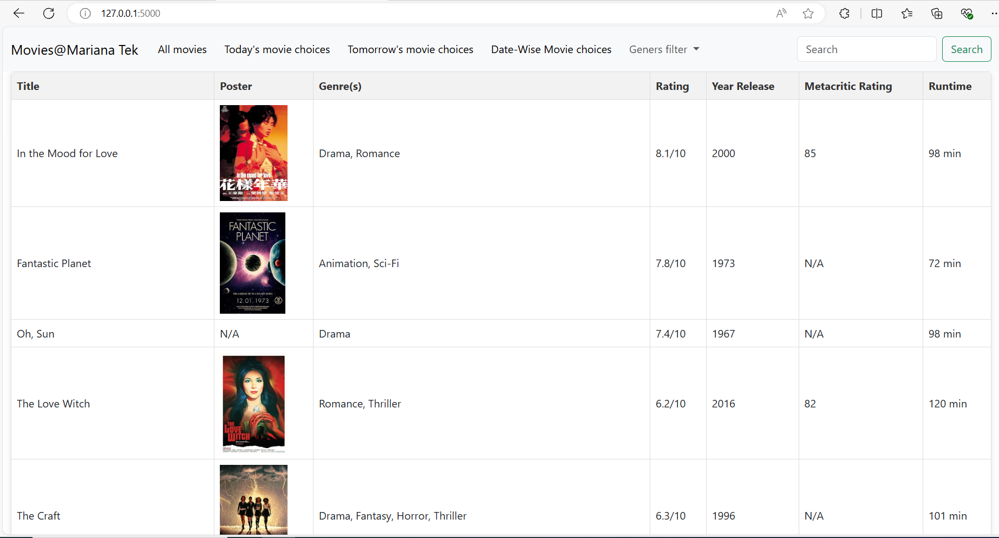
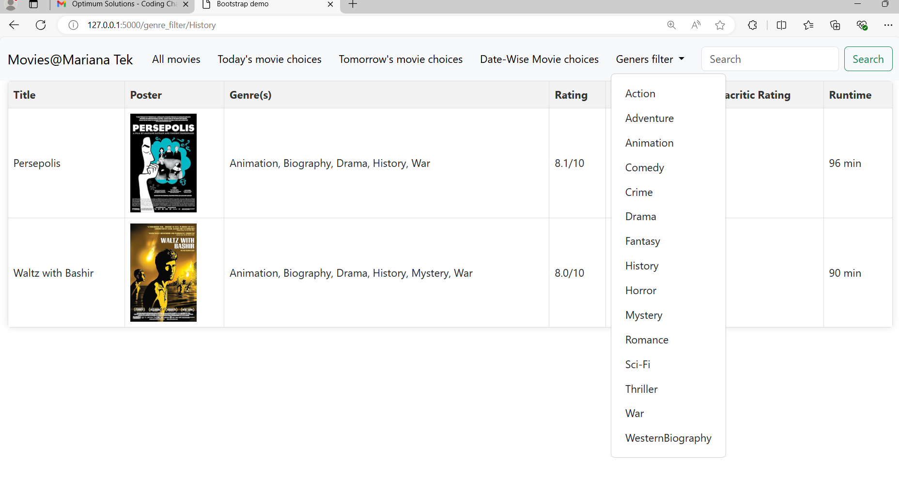
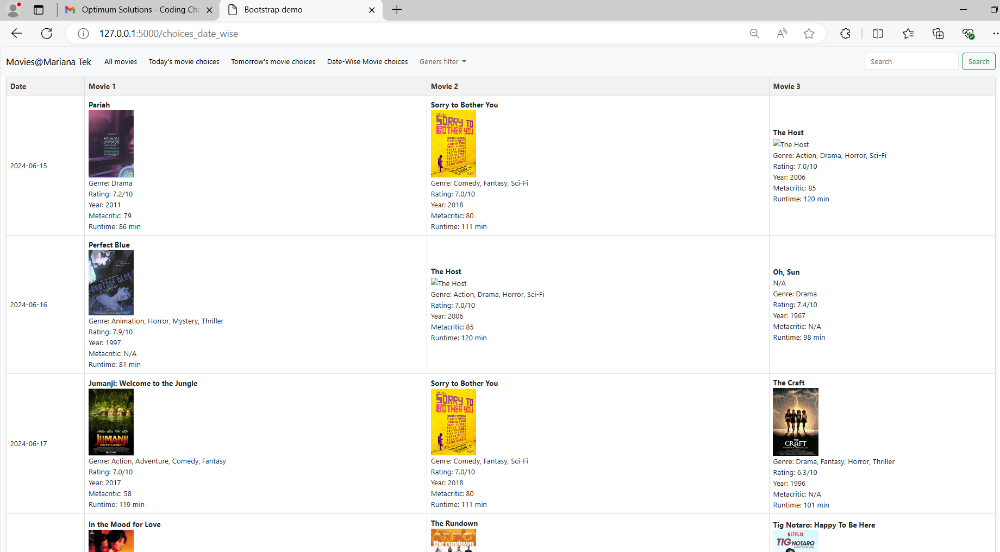

# Movie Listing App

This is a movie listing application that allows users to view a list of movies and make selections for today's and tomorrow's movie 
choices. and also we can see date wise movies for max 8 days Additionally, users can filter movies based on genre and search for specific movies based on their title.

## Features

- **Movie Listing:** Users can view a comprehensive list of movies available in the application.
- **Today's Movie Choices:** Users can see the movie choices available for the current day.
- **Tomorrow's Movie Choices:** Users can see the movie choices available for the next day.
- **Genre Filtering:** Users can filter movies based on genre to find movies of their interest.
- **Search by Title:** Users can search for specific movies by entering their title.


### Home Page




### Genre Filtering



### Date wise choices




## Installation
### Prerequisites
- please install requirements.txt file

### Steps
1. Clone the repository:
   ```bash
   git clone https://github.com/RahulG7775/optimum_task.git


### Start the app 
   ```bash
   python main.py
